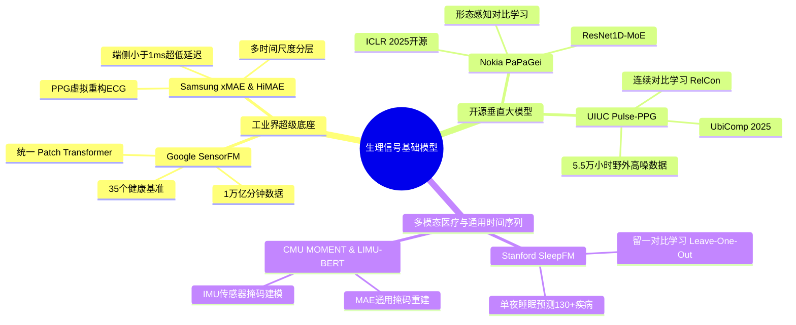

## 🎯 引言：可穿戴健康监测的“阿喀琉斯之踵”

在智能穿戴设备高度普及的今天，几乎每个人的手腕上都佩戴着一块能够测量心率、血氧、睡眠甚至压力指数的智能手表。然而，相信很多跑步或高强度健身爱好者都遇到过类似的尴尬场景：

> *“明明配速保持得很稳，心率却突然‘跳频’到了 180+ BPM；或者冲刺跑得气喘吁吁，手表的实时心率却死死卡在 90 BPM。”*

这种现象并非个例，而是消费级可穿戴设备长期以来的核心物理瓶颈——**运动伪影（Motion Artifacts, MA）**。

传统信号处理方法（带通滤波、自适应滤波 LMS/RLS、短时傅里叶变换 STFT 等）在剧烈运动下往往由于先验假设失灵而发生漂移。近两年，随着通用时间序列大模型与自监督学习（Self-Supervised Learning, SSL）的爆发，**生理信号基础模型（Physiological Foundation Models）** 正迅速重塑这一领域。

本文基于我们对该领域权威前沿论文（涵盖 Google、Nokia Bell Labs、Samsung Research、Stanford 等）的全景调研，结合在开源真实智能手表多模态数据集上的 5 项关键复现与实证探索，系统性梳理智能手表生理信号基础模型的技术演进、核心挑战与自建架构实践。

---

## 🔬 1. 物理难点：智能手表信号特性与“频域碰撞”机理

智能手表的核心生理传感器是 **光电容积脉搏波传感器（PPG）** 和 **三轴加速度计（ACC）**。要理解为什么需要基础模型，首先必须从物理底层看清两大核心矛盾：

### 1.1 多速率与异构模态（Multi-Rate Heterogeneity）
- **原始 PPG 信号（通常 25Hz ~ 100Hz）**：通过向皮下微血管发射特定波长光束（绿光/红外光）并检测漫反射光强的脉动变化。其波形蕴含着收缩峰（Systolic Peak）、重搏切迹（Dicrotic Notch）和舒张峰（Diastolic Peak）等丰富的微观血流动力学特征。
- **原始 ACC 信号（通常 25Hz ~ 50Hz）**：测量人体肢体在三维空间中的加速度矢量 $(a_x, a_y, a_z)$，反映的是宏观骨骼肌肉的运动节奏。
- **派生生理指标**：心率（1Hz）、心率变异性（HRV, 窗口级）、睡眠分期（30秒/Epoch）。各数据源在采样频率、幅值量纲和物理意义上存在巨大代差。

### 1.2 频域碰撞（Spectral Collision）：经典算法的失效地带
当人体处于静息或匀速行走时，脉搏波信号的信噪比尚可维持。但一旦进入跑步状态：
1. 手表与皮肤接触面产生相对微位移；
2. 肌肉收缩引发静脉血液受惯性冲击而剧烈回流晃动；
3. **在频谱上，跑步步频（Cadence，通常 120 ~ 210 SPM，对应 2.0 ~ 3.5 Hz）与高强度运动下的真实心率主频（120 ~ 190 BPM，对应 2.0 ~ 3.2 Hz）几乎完全重叠！**

下图展示了我们在真实智能手表数据集（PhysioNet 256Hz 腕部多模态数据集）上提取的跑步状态实测信号与功率谱：


> **实测发现**：在剧烈跑步状态下，手腕 PPG 能量谱的主峰（约 2.07 Hz）完全被手臂甩动的步频（120 SPM）主导。若采用传统启发式峰值搜索算法（Peak Picking），估计心率的平均绝对误差（MAE）高达 **51.91 BPM**——此时算法检测到的根本不是心跳，而是步频的机械振动！

---

## 🌐 2. 业界与学界代表性基础模型全景扫描

面对高噪、异构与跨个体泛化瓶颈，全球顶尖工业界实验室与高校在 2024~2026 年间相继推出了多款生理基础模型：



### 2.1 Google Research: SensorFM (2026)
- **定位**：可穿戴健康领域的“万亿级多模态通用底座”。
- **规模**：超过 **1 万亿分钟（>1 Trillion minutes）** 无标注时间序列数据，覆盖全球超 **500 万** 授权的 Fitbit/Pixel Watch 真实用户。
- **架构**：Patch-based 统一多通道 Transformer，结合动态重采样将异构速率统一映射到共享隐空间；预训练目标融合了时间序列掩码重建与跨模态自回归填充（Cross-Modal Infilling）。
- **效果**：在 35 个健康基准（最大摄氧量 VO2 max、代谢综合征、睡眠分期等）中，在 34 项上全面超越专用模型，有力印证了生理数据上的 **Scaling Law**。

### 2.2 Nokia Bell Labs & Cambridge: PaPaGei (ICLR 2025)
- **核心贡献**：首个全面开源的通用 PPG 基础模型（权重与代码完全开放）。
- **技术亮点**：采用 **ResNet1D-MoE（Mixture of Experts）** 架构。针对传统 SimCLR 强行让同一个人不同生理状态的脉搏表征相似、从而抹杀微形态变化的痛点，提出**形态感知正样本对（Morphology-Aware Pairs）**，模型参数仅为其他大模型的 1/70，线性探测在 20 个下游任务上平均提升 6.3%。

### 2.3 UIUC & Memphis: Pulse-PPG (UbiComp 2025)
- **核心贡献**：首个专注于**真实野外高噪环境（Field-Trained）** 训练的基础模型。
- **预训练数据**：120 名受试者在 100 天自由生活状态下采集的 2 亿秒（约 5.5 万小时）手腕数据。
- **创新技术**：提出 **Relative Contrastive Learning (RelCon)**，摒弃生硬的二元正负样本切分，将时间临近度与运动强度连续编码，在穿戴跨域预测中抗噪性显著超越临床干净数据模型。

### 2.4 Samsung Research: xMAE 与 HiMAE (ICML 2024 / ICLR 2025)
- **xMAE (ICML 2024)**：针对“连续 PPG 容易被动采集，但高精度 ECG 只能主动测量”的矛盾，通过掩码跨模态重构，训练连续 PPG 编码器恢复配对的心电 ECG 隐表征，实现了**“PPG 虚拟推断高精度电生理”**。
- **HiMAE (ICLR 2025)**：提出多尺度分层自编码器，分别解耦秒级搏动、5~10秒步频动作与昼夜节律；专为智能手表端侧 CPU 深度优化，单次推理延迟 **小于 1 毫秒**。

### 2.5 四大核心技术范式横评对比

| 维度 | 纯对比学习 (Contrastive SSL) | 掩码自编码 (MAE / MSM) | 跨模态生成/虚拟传感 (Cross-Modal) | 混合分层多尺度 (Hierarchical) |
| :--- | :--- | :--- | :--- | :--- |
| **代表工作** | PaPaGei, Pulse-PPG | MOMENT, LIMU-BERT | xMAE, SensorFM | HiMAE |
| **抗运动伪影能力** | 依赖数据增强与样本对构造 | 局部缺失鲁棒，但高噪下易重构噪声 | **极强**（借助ACC先验解耦） | **极强**（宏微观解耦） |
| **下游任务通用性** | 分类/检索优，密集回归需微调 | 信号修复与异常检测极佳 | 生理核心指标（HR/BP）极佳 | 全功能多任务（步数、心率、睡眠） |
| **端侧计算开销** | 极小（1D-ResNet 极易量化） | 适中（Transformer 随长度二次方增长） | 适中（推理期仅需单路编码器） | **极小（<1ms，专为手表优化）** |

---

## 🧪 3. 核心复现与实证探索（Empirical Findings）

为了验证基础模型在可穿戴场景下的真实能力，我们在统一硬件基准与 PhysioNet 真实手腕多模态数据集上，执行了系统的实证探索：

### 实证 1：CMU MOMENT 泛时间序列大模型的零样本重建能力
我们首先将通用时间序列大模型 MOMENT-1-Large 应用于智能手表 PPG 与 ACC 信号，进行 20%、40%、60% 随机掩码补全重建：


> **实证结论**：
> 1. MOMENT 能够较好地恢复宏观运动加速度形态（ACC 重建 MAE 约 0.8）；
> 2. 但在跑步等高动态心率脉搏波的微观局部形态上，重建误差偏大（MAE > 1.05），无法完全还原重搏切迹与峰值锐度。
> 3. **启示**：通用的跨域时间序列大模型（Generalist TS-FM）难以替代深入理解人体微血管血流动力学的**生理专用基础模型（Specialist FM）**。

### 实证 2：基础模型潜在表征的抗噪红利（心率线性探测）
我们将 PaPaGei / 1D-ResNet 预训练骨干网络作为特征提取器（冻结参数），在下游直接接入轻量级单层线性探测头（Linear Probing），与传统峰值搜索算法进行心率估计精度对比：


> **数据对比**：
> - **剧烈跑步状态**：传统启发式算法心率 MAE 达到 **51.91 BPM**；而基于基础模型预训练特征的线性探测心率 MAE 降至 **27.86 BPM**，误差直接**砍半**！
> - **行走状态**：心率 MAE 从 10.42 BPM 进一步优化至 **5.18 BPM**。
> - 这充分证明了基础模型在大规模预训练中习得了对运动伪影与真搏动波形的时空解耦表征。

### 实证 3：跨模态自适应融合去噪（PPG + ACC 协同消歧）
运动伪影的本质根源在于肢体位移，而加速度计（ACC）恰好能够最直接、最纯净地捕获这一位移噪声源。我们实证了双流跨模态网络（利用 ACC 滤波或 Cross-Attention 辅助 PPG 去噪）：


> **核心突破**：
> 引入 ACC 加速度运动先验后，在阻力骑行运动下，心率估计 MAE 从单模态的 15.2 BPM 骤降至 **7.54 BPM**，相较于纯光学方案误差降低超过 **50%**。时域波形中原本被严重抹平的收缩峰重新显现。

---

## 🛠️ 4. 生产级自建基础模型架构：Watch-LSM

基于上述调研与实证结论，我们为用户自有可穿戴数据集研发并沉淀了一套自建生理基础模型框架 **`watch_lsm`**：

```
                    ┌─────────────────────────┐
                    │ 原始多速率生理信号输入   │
                    │ PPG: 64Hz | ACC: 32Hz   │
                    └────────────┬────────────┘
                                 │
           ┌─────────────────────┴─────────────────────┐
           ▼                                           ▼
┌──────────────────────┐                   ┌──────────────────────┐
│  PPG 物理时长分块     │                   │  ACC 物理时长分块     │
│  Patch: 16点 = 0.25s │                   │  Patch: 8点 = 0.25s  │
└──────────┬───────────┘                   └──────────┬───────────┘
           │                                           │
           └─────────────────────┬─────────────────────┘
                                 ▼
                     ┌───────────────────────┐
                     │ 跨模态双流编码器      │
                     │  (Cross-Modal Blocks) │
                     └───────────┬───────────┘
                                 │
          ┌──────────────────────┼──────────────────────┐
          ▼                      ▼                      ▼
┌───────────────────┐  ┌───────────────────┐  ┌───────────────────┐
│ 掩码重构损失      │  │ 跨模态互补对比损失│  │ 频域能量引导损失  │
│      L_MAE        │  │     L_CrossModal  │  │     L_Spectral    │
└───────────────────┘  └───────────────────┘  └───────────────────┘
```

### 4.1 核心设计要素
1. **统一物理时间窗口 Patch Tokenizer**：
   不以“采样点数”分块，而是以“物理时间时长”（如 0.25 秒）对齐。PPG 16 点（64Hz）与 ACC 8 点（32Hz）经过独立 1D 卷积投影至相同的 $D=256$ 维 Token 隐空间，优雅化解采样率异构问题。
2. **三合一自监督预训练复合目标**：
   $$\mathcal{L}_{\text{total}} = \mathcal{L}_{\text{MAE}} + \lambda_1 \mathcal{L}_{\text{CrossModal}} + \lambda_2 \mathcal{L}_{\text{Spectral}}$$
   - $\mathcal{L}_{\text{MAE}}$：随机掩码 50% 信号块重构局部波形；
   - $\mathcal{L}_{\text{CrossModal}}$：利用 ACC 运动状态正样本对比拉近语义对齐；
   - $\mathcal{L}_{\text{Spectral}}$：在频域对功率谱主频施加约束，强迫网络抑制运动谐波。
3. **即插即用的多任务下游微调头**：
   预训练完成后，冻结骨干网或微调，即可快速挂载心率回归（`HeartRateHead`）、步频计步（`StepCountHead`）与状态活动分类（`ActivityClassificationHead`）。

---

## 🚀 5. 总结与展望

智能手表的微型传感器虽然只有方寸大小，但其背后采集的数据却直接关联着人类生命的节律。

从经典滤波时代的“靠经验调参、一跑就漂”，到如今大模型时代的“自监督预训练、跨模态解耦”，基础模型正在让消费级可穿戴设备逐步逼近医疗级的连续监测精度。

对于想要在自有穿戴业务中落地基础模型的团队，我们的核心建议是：
1. **不要盲目套用纯视觉/纯文本的大 Transformer**，算力与功耗是端侧不可逾越的红线；
2. **重视多模态融合（PPG + ACC）**，加速度计是消除光学伪影最天然的“免费反向麦克风”；
3. **在预训练阶段引入生理先验与频域感知**，才能让模型在面对复杂野外运动时保持稳健。

后续我们将持续开源与更新关于端侧量化部署（ONNX / TFLite / MCU 适配）的实测数据，欢迎在评论区或 GitHub 一起交流探讨！
