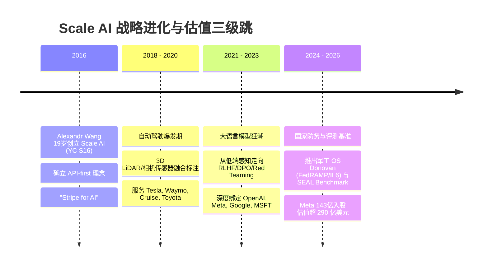
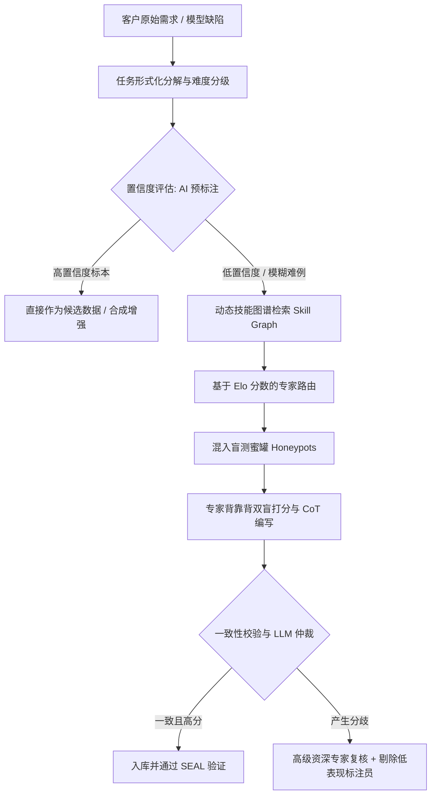

## 🎯 引言：290亿美元的震撼弹与资本市场的“双标”

据路透社及彭博社报道，**Meta 以约 143 亿美元战略性取得 Scale AI 49% 的股权，将这家数据服务公司的投后估值推高至惊人的 290 亿美元**。更引人瞩目的是，Scale AI 创始人兼 CEO Alexandr Wang（汪德）随之出任 Meta 超级智能实验室（Meta Superintelligence Labs, MSL）负责人，同时继续留任 Scale AI 董事会。

一家不研发基础大模型、不直接做消费级 AI 原生应用、长期被业内戏称为“帮 AI 画框、打标签”的数据标注公司，凭什么能拿到接近 300 亿美元的超高定价？

这个问题真正值得深度探究的，绝非一句肤浅的“原来数据标注这么赚钱”，而是背后的结构性割裂：

> **为什么同样是从事 AI 训练数据服务，Scale AI 能被硅谷资本市场按照【AI 核心基础设施】（估值倍数超过 25x–30x ARR）来狂热定价，而国内多数数据标注公司（如科创板上市的海天瑞声、新三板的数据堂及大量未上市标注基地）仍然被资本市场视作【项目制劳务外包商】与【低毛利加工厂】（估值倍数长期徘徊在 2x–5x PS 或遭遇低市盈率折价）？**

本文将融合财务数据、客户结构、研发投入、人员组织以及端到端业务模式，彻底拆解现代数据标注产业的底层飞轮，并深度回答三个核心问题：
1. **Scale AI 到底贵在哪里？**
2. **Scale AI、海天瑞声和数据堂到底有什么本质不同？**
3. **海天瑞声和数据堂如果走向 Scale AI 的模式，谁更容易？谁的天花板更高？**

---

## ⚡ 一、Scale AI 的创始人背景与战略三级跳

理解 Scale AI 的高估值，必须先理解其创始团队的工程基因与业务演进路径。



### 1. 创始人画像：极客基因与顶尖工程嗅觉
Scale AI 创立于 2016 年，由当时年仅 19 岁、刚从麻省理工学院（MIT）计算机系辍学的 **Alexandr Wang（汪德）** 与 **Lucy Guo（郭文景）** 共同联合创立（入选 Y Combinator S16 批次）。
- **家庭背景**：Alexandr Wang 出生于新墨西哥州洛斯阿拉莫斯（Los Alamos）——即美国著名的原子弹发源地与国家实验室所在地。父母均为顶尖核物理学家，他自幼便浸润在高密度数理科学与工程文化中。
- **传奇履历**：中学斩获全美数学与编程竞赛奖项，17 岁任职 Quora 算法工程师，19 岁就读 MIT 大一后毅然退学创立 Scale AI。2022 年，年仅 25 岁的他以超 10 亿美元身家被《福布斯》评为“全球最年轻的白手起家亿万富豪”。
- **工程信仰**：创立第一天起，Alexandr Wang 就确信：**算法的尽头是数据工程，而高质量标注的瓶颈在于人类认知的精准结构化**。他没有把公司定位为劳务中介，而是高举“**AI 时代的 Stripe**”旗号——将复杂的物理世界数据标注抽象为极致简单的 RESTful API 接口。

### 2. 商业演进的三级跳跃
* **阶段一：自动驾驶多传感器融合（2016–2020）**
  切入对数据质量要求最苛刻的自动驾驶赛道（LiDAR 激光雷达点云、3D 边界框、连续时序多相机融合追踪）。拿下 Tesla、Waymo、Cruise、丰田等标杆车企，建立了首个将计算机视觉辅助工具（AI Pre-labeling）嵌入人工标注流程的闭环系统。
* **阶段二：生成式 AI 与前沿模型后训练（2021–2023）**
  在 ChatGPT 爆发前夕敏锐押注大语言模型（LLM）的**后训练（Post-Training）**环节。全面转型为基础模型实验室（Frontier Labs）提供 **SFT（监督微调）、RLHF（人类反馈强化学习）、DPO（直接偏好优化）及 Red Teaming（红队攻防安全测试）** 数据服务。成为 OpenAI（GPT-4 系列）、Meta（Llama 系列）、Google、Anthropic 最倚重的数据军火库。
* **阶段三：国家安全防务与模型评测（2024–2026）**
  打造高壁垒企业级产品 **Scale Donovan**——面向美国国防部（DoD）、中央司令部及情报机构的涉密级 AI 操作系统（通过 FedRAMP High 及 DoD IL6 最高安全合规认证）。同时推出 **Scale SEAL（安全评测与对齐实验室）**，制定行业公认的大模型综合 Benchmark，掌握了前沿模型的“裁判权”。

---

## ⚙️ 二、现代 AI 数据服务产业的全景运转逻辑

要真正看清 Scale AI 与传统数据加工厂的鸿沟，必须解构这个产业的四重核心运转支柱：**需求如何创建、人力如何供给、人与任务如何匹配、端到端飞轮如何自运转**。


### 1. 需求如何创建：从“被动接单”到“主动定义模型食谱”

传统数据标注的需求创建是极其被动的：客户有一批图片需要画框，或者一段音频需要听写，便起草一份几十页的静态标注规范（Annotation Guideline），然后发标寻找供应商，最后按标注张数或小时进行价格比拼。

**在大模型与前沿 AI 时代，需求的创建逻辑发生了根本性颠覆：**

```text
┌────────────────────────────────────────────────────────────────────────┐
│                   前沿大模型全周期数据需求体系                          │
├───────────────────┬───────────────────┬────────────────────────────────┤
│ 预训练 (Pre-train)│ 启发式清洗与配比   │ 网页过滤、多语言去重、代码配比 │
├───────────────────┼───────────────────┼────────────────────────────────┤
│ 监督微调 (SFT)    │ 复杂思维链 (CoT)  │ 数理推导、函数调用、长程逻辑   │
├───────────────────┼───────────────────┼────────────────────────────────┤
│ 强化学习 (RLHF/DPO)│ 偏好对抗与多维打分 │ 正负样本对构建、安全性与诚实性 │
├───────────────────┼───────────────────┼────────────────────────────────┤
│ 红队测试 (RedTeam)│ 越狱与逆向渗透测试 │ 提示词注入、毒性挖掘、合规防御 │
├───────────────────┼───────────────────┼────────────────────────────────┤
│ 评估基准 (Eval)   │ 动态不可刷榜 Benchmark│ 真实业务场景盲测、Agent 轨迹测试│
└───────────────────┴───────────────────┴────────────────────────────────┘
```

Scale AI 的需求并非单纯来自客户的工单，而是**与基础模型科学家共同探讨“下一代前沿模型在哪些领域出现了性能坍塌与幻觉”**：
- 如果模型在复杂几何解题与代码漏洞分析上表现差，Scale AI 会主动设计一套包含数十步多重分支与严谨形式化验证的数据集架构方案；
- 通过 Scale SEAL 排行榜，实时向客户暴露模型的长尾缺陷（Failure Modes），从而**反向催生出高客单价、高利润率的定制化前沿对齐数据订单**。

### 2. 人力如何供给：从“廉价农民工”到“博士认知外脑网络”

数据标注常被误解为密集型体力劳动。但在今天，人力供给结构已经彻底分化为两极：

1. **基础感知层（基础众包平台）：**
   Scale AI 旗下的 **Remotasks** 拥有数十万分布于肯尼亚、菲律宾、印度、拉美等低劳动力成本地区的众包人员。他们时薪在 1.5–5 美元左右，主要负责 2D/3D 视觉框选、视频行为分割以及基础指令分类。
2. **高端认知层（Outlier.ai 专家网络）：**
   当生成式模型需要评判研究生级别的拓扑数学、跨平台编译器优化代码、罕见病临床诊断或特拉华州公司法裁决时，传统众包人员完全无能为力。
   Scale AI 裂变出 **Outlier.ai** 平台，在全球招募了数万名**具备博士/硕士学位、名校背景的软件架构师、执业医师、律师、经济学家与数学竞赛教练**。平台为这些高认知兼职者支付 **$40 至 $150+ 的时薪**。
   这一布局使 Scale AI 能够垄断全球稀缺的“高认知智慧供给”，成为全球科技巨头购买高质量后训练数据的唯一规模化供应源。

### 3. 人与任务如何匹配：算法驱动的动态分发与蜜罐熔断

如何保证分散在全球的数十万人不会在复杂专业任务中注水或摸鱼？这是 Scale AI 构筑的深厚软件护城河：



- **动态技能图谱（Skill Graph）与 Elo 天梯积分**：每个标注者（从肯尼亚初级工到斯坦福博士）都在系统内拥有多维胜率天梯。某人可能擅长 Python 但不擅长 Rust，擅长法律文书但不擅长金融审计。任务调度引擎会根据题目的领域与难度系数，毫秒级精准路由给历史 Elo 评级最高的人员。
- **盲测蜜罐机制（Honeypots / Gold Standards）**：在常规任务流中，系统会以固定概率（如 10%-15%）随机混入**已知标准答案的高难度测试题**。一旦标注人员给出的答案与黄金标准发生偏离，系统立即无感扣减其信誉分，严重者直接秒级熔断冻结账户，确保整体数据集的极低幻觉率。
- **主动学习与多智能体共识（Multi-Annotator Consensus）**：先让自身内部的大模型进行预标注（降低 60%-70% 人工耗时），仅将模型“感到困惑”（Uncertainty 高）的临界样本派发给多位专家独立处理，最后通过自动化验证器（如代码自动编译运行测试用例、数理符号引擎自动验算）完成双重质检。

### 4. 运转飞轮：数据引擎的自我强化闭环

一旦这套飞轮运转起来，它就呈现出惊人的正向循环：
**客户越多 → 处理的长尾 Bad Cases 越多 → 积累的模型缺陷诊断与合成数据能力越强 → 标注自动化率越高、单位标注成本越低 → 交付速度与精度压倒竞争对手 → 吸引更多 Tier-1 客户锁定。**

---

## 🔍 三、回答三大核心问题：深水区对比与战略推演

### 问题一：Scale AI 到底贵在哪里？为什么被当作基础设施定价？

**Scale AI 的 290 亿美元估值，本质上是资本市场对其在 AI 产业链中“不可替代卡位”所支付的极度稀缺性溢价。**

| 维度 | 传统数据外包公司（BPO 逻辑） | Scale AI（AI 基础设施逻辑） |
| :--- | :--- | :--- |
| **资本市场估值倍数** | 2x – 5x PS，15x – 20x PE | **20x – 30x+ ARR**（科技基础设施溢价） |
| **收入确认模式** | 项目制一次性计费，按人天/人月结算 | **API 订阅 + 调用量弹性计费 + 长期防务平台订阅** |
| **客户粘性与集成度** | 低，每年通过招投标比价，容易被平替 | **极高，API 深度嵌入客户大模型训练 CI/CD 管道** |
| **边际成本特性** | 线性递增（每多做100万数据就多雇100个人） | **非线性递减（AI 预标注与自动化验证替代率逐步提升）** |
| **最高壁垒资产** | 地方园区厂房、低成本人员管理规模 | **SEAL 评测基准话语权 + 军工涉密安全准入资质** |

具体而言，其核心溢价由以下四大支柱支撑：
1. **API-First 的软件产品属性**：客户从使用 Scale 开始，就调用其 SDK 自动拉取数据、自动上报训练日志。它像云服务基础设施一样嵌入在模型迭代链路中，更换供应商的摩擦成本极高。
2. **模型“后训练（Post-Training）”的顶级认知特许权**：大模型的预训练数据几乎被全网爬尽，未来决定 GPT-5、Llama 4 差异化的关键正是 RLHF、复杂推理与安全对齐。Scale AI 拥有全球最庞大且最规范的顶级认知专家网络，是各大科技巨头“不可断供的军火库”。
3. **军工防务与最高国家安全护城河（Donovan）**：美国国防部（DoD）的数亿美元订单不是普通外包商能碰的。通过 FedRAMP High 和 IL6 涉密认证，意味着获得了美国政府“最高信任背书”，这带来了极高的现金流确定性与政治壁垒。
4. **资本与客户的深度生态锁死**：Meta 不仅是客户，更以 143 亿美元巨资买下 49% 股权；此前 Nvidia、Amazon、Alphabet、OpenAI 均为其股东。巨头们既是金主，又是股东，又是算力供应商，这种协同形成了坚不可摧的商业壁垒。

---

### 问题二：Scale AI、海天瑞声、数据堂到底有什么本质不同？

我们将 Scale AI 与国内最具代表性的两家 AI 数据企业——**科创板上市龙头海天瑞声（688787.SH）**、**新三板元老数据堂（831428.OC）**进行全方位的横向解剖：

| 深度剖析维度 | **Scale AI** | **海天瑞声 (SpeechOcean)** | **数据堂 (Datatang)** |
| :--- | :--- | :--- | :--- |
| **最新估值 / 市值** | **~290 亿美元 (约 2080 亿 RMB)** | **~50 - 70 亿 RMB** (动态波动) | **~10 - 15 亿 RMB** (新三板流动性折价) |
| **年营收规模** | **10 亿+ 美元** (约 70-80 亿+ RMB) | **~3.5 - 4 亿 RMB** (2025年约3.77亿) | **~1.0 - 1.5 亿 RMB** |
| **核心客群结构** | 全球 Frontier Labs (Meta, OpenAI, Google) + 美国国防部 (DoD) | 微软、亚马逊等海外科技巨头 + 国内大厂 (阿里、腾讯、字节、华为) | 国内车企、安防巨头、互联网公司、科研院所 |
| **核心业务与产品矩阵**| ① GenAI RLHF/DPO 对齐<br>② Scale Donovan 军工操作系统<br>③ SEAL 行业评测基准<br>④ 自动驾驶感知与合成数据 | ① 自研标准化智能数据集 (成品库，语音为主)<br>② 定制化数据采集与标注 (DOTS 平台)<br>③ 智能网联汽车多模态数据 | ① 数据集商城产品销售<br>② 定制化采集与标注解决方案 (人车场景)<br>③ 标注平台私有化部署 |
| **收入与毛利结构** | 混合型：高毛利软件与防务订阅 + 高客单价专家对齐 (综合毛利率 45%-60%) | 成品数据集毛利超 60%；定制化服务毛利 30%-40% (综合毛利约 40%-50%) | 定制化服务占比大，受竞价与外包成本挤压，综合毛利 30%-45% |
| **研发与人员底色** | 硅谷顶尖 AI 算法研究员与全栈工程师占比极高；研发人员年薪与产出极高 | 语言学、声学专家与软件工程团队；具备较强的全球多语种音素标注工程能力 | 计算机视觉与行业数据项目经理为主，重交付流程管控 |
| **人力供给组织形式**| **Outlier.ai 高端认知全球专家库** + Remotasks 低成本众包 | 自有核心质检 + 战略合作基地 + 全球兼职母语发音人资源网络 | 自建及合作第三方线下标注基地 + 大规模社会化众包团队 |

#### 深度差异剖析：
1. **产业链话语权与采购定位的差异**：
   - 国内科技大厂与车企在采购海天瑞声、数据堂时，往往由**采购部与外包管理部**主导，其核心 KPI 是“降本”与“压账期（账期普遍长达 6-12 个月）”，把数据标注当成了和保洁、外包安保类似的“项目制劳务耗材”。
   - 而 Meta、OpenAI 采购 Scale AI 时，通常由**大模型基础算法负责人与 CTO 办公室**直接对接，其核心关注的是“模型对齐指标能否提升 2 个百分点”，采购的是模型能力的跃迁，而非人头工时。
2. **产品形态与复用性差异**：
   - 海天瑞声的核心亮点在于其**成品数据集（尤其是智能语音与小语种语料库）**，这种资产拥有极高的单次毛利（超 60%），但缺点是“低频复购”——同一套语料库很难反复高价卖给同一家客户。
   - Scale AI 卖的是**持续运转的数据工厂（Continuous Data Engine）与模型评测订阅**，客户的模型每周都在迭代，Scale 的 API 就每周都在实时清洗、生成与打标，形成了极高频且持续扩大的 SaaS 式 ARR。

---

### 问题三：海天瑞声和数据堂走向 Scale AI 方向，谁更容易？谁的天花板更高？

如果国内数据服务商决心摆脱“人头外包”的宿命，向 Scale AI 式的“AI 数据与评测基础设施”转型，海天瑞声和数据堂各自面临怎样的胜率与天花板？

```mermaid
quadrantChart
    title 国内数据标注厂商转型战略矩阵
    x-axis 低资本与出海能力 --> 高资本与出海能力
    y-axis 低大模型通用认知天花板 --> 高大模型通用认知天花板
    quadrant-1 战略破局区 (Scale AI 领地)
    quadrant-2 细分垂类冠军区 (具身智能/专用感知)
    quadrant-3 劳务外包红海 (传统标注基地)
    quadrant-4 资本驱动出海区 (稳健增长)
    "海天瑞声 (SpeechOcean)": [0.75, 0.55]
    "数据堂 (Datatang)": [0.35, 0.40]
    "新兴垂类专家型 Studio": [0.45, 0.70]
```

#### 1. 谁更容易迈出第一步？——【海天瑞声更容易】
- **资本平台优势**：海天瑞声是科创板上市公司，拥有畅通的二级市场再融资通道、股权激励工具和资金实力，能够承受搭建顶尖 AI 算法团队与全球专家网络的研发前置亏损。而数据堂困守新三板，融资受限，容错率极低。
- **天然的国际化基因与跨国客户基础**：海天瑞声历史上有相当高比例（40%–50%）的收入来自微软、亚马逊等海外跨国巨头，对海外法律法规、数据合规（GDPR）以及全球多语种交付有着深厚经验。要承接前沿大模型的出海需求，海天瑞声具有即插即用的通道优势。

#### 2. 谁的天花板更高？——【两者的上限取决于能否完成“组织与基因质变”】
- **海天瑞声的天花板与桎梏**：
  - *优势*：如果在全球语音大模型（如 GPT-4o 级端到端音频交互）、多模态对话以及出海企业多语言本地化上深度下注，它能迅速成为全球语言数据细分巨头。
  - *掣肘*：其底色是“声学与语音数据集贩卖商”。大模型的最核心战力在于**复杂数理逻辑推理、代码编写与多智能体交互轨迹**，这些并非语言学家的传统势力范围。若无法彻底重构为全模态、强代码、深推理的工程化平台，其市值天花板很难突破两三百亿人民币。
- **数据堂的突围路径与潜在空间**：
  - *优势*：数据堂在计算机视觉、人脸与体态动作、智能网联驾驶（车路协同、传感器标定）方面有大量非标工程积累。
  - *突破口*：在当前纯大模型文本标注陷入大厂自建的夹缝中，数据堂如果避开文本 RLHF 锋芒，**果断重注“具身智能（Embodied AI）与机器人空间感知数据”**，为下一代仿生机器人和自动驾驶长尾场景定制“真实物理交互+虚拟仿真合成数据引擎”，反而可能在垂直赛道找到独特的第二曲线。

**最终结论：**
> **海天瑞声更容易在短期内获得业绩与出海突破；但双方若想触碰千亿级 Scale AI 的天花板，核心决胜点不在于积累了多少“历史数据集”，而在于能否破釜沉舟地引入硅谷级系统架构师与研究员，将组织形态彻底从“项目制承包商”改造为“以模型评测与主动合成驱动的底层基础设施”。**

---

## 🚀 四、新玩家破局指南：今天如何进入 AI 数据产业赛道？

如果你是技术创业者、产业投资者或希望切入此领域的团队，**千万不要再去建传统的“低端拉框标注基地”或买通用开源标注平台倒卖人头——这是确定性破产的红海路径**。

今天切入 AI 数据标注与模型工程服务，必须寻找具备**“高认知壁垒”与“强工程闭环”**的结构性缝隙：

### 1. 垂直领域高精尖认知 RLHF 工场（Vertical Expert-in-the-Loop）
- **痛点**：通用标注团队根本不懂芯片 EDA 代码、单抗药物化学分子式、疑难病理切片诊断、跨境税务合规。
- **破局点**：组织垂直领域的精英行家（兼职三甲医生、执业专利律师、资深集成电路架构师），提供高客单价的**领域思维链（CoT）与细粒度对齐评测服务**。这类服务的毛利率可达 60% 以上，且客户具备极强的付费意愿。

### 2. Agent 仿真沙盒与多步行动轨迹合成（Agent Trajectory & Sandbox Engine）
- **痛点**：下一代 AI 从 Chat 走向 Action（智能体 Agent）。但互联网上根本不存在足够多的“浏览器自主订票”、“操作 SAP 软件财务报销”、“在终端调试复杂 Docker 集群”的高质量执行轨迹。
- **破局点**：构建真实的沙盒执行环境（Sandboxed Virtual Machines & Browsers），利用合成技术配合高水平测试工程师，沉淀包含“观察（Observation）- 思考（Thought）- 动作（Action）- 结果（Reflection）”的超长程多轮 Agent 训练数据集。

### 3. 模型红队攻防与安全性评测即服务（Red Teaming & Benchmark-as-a-Service）
- **痛点**：金融机构、政企客户部署私有化大模型时，最大的恐惧是“越狱、泄密、幻觉与政治/合规风险”。
- **破局点**：借鉴网络安全公司的渗透测试逻辑，建立专门的“大模型红队攻防实验室”，针对企业级知识库与业务场景进行全方位对抗攻击测试，出具权威认证合规评测报告。

### 4. 具身智能与物理世界多传感器遥测数据（Embodied AI Physical Telemetry）
- **痛点**：机器人无法靠纯文本学会端茶倒水、拧螺丝和精密装配，真实世界的触觉、力控、6DoF 动作轨迹极度匮乏。
- **破局点**：结合 VR 头显、触觉手套和外骨骼遥操作系统，采集高精度人体工学动作轨迹数据，并结合真实世界物理渲染器（如 Isaac Sim）进行多倍率合成增强，做具身智能时代的“物理世界数据引擎”。

---

## 💡 结语：数据的尽头不是劳务，是智能的刻度尺

Scale AI 的 290 亿美元神话，彻底撕下了传统数据标注“数字流水线民工”的标签，为全球 AI 从业者昭示了一个不可逆的真理：

**在算法模型与硬件算力逐渐同质化的后大模型时代，决定顶级模型智商上限与行业落地的，正是注入进权重中那些微小、严谨、深邃的人类高阶智慧结晶。**

做数据标注不可耻，可耻的是永远停留在低水平重复的人头转包；谁能成为大模型进化道路上那把最精准、最可靠、最具系统性的“智能刻度尺”，资本市场就会毫不犹豫地将千亿王冠授予谁。
